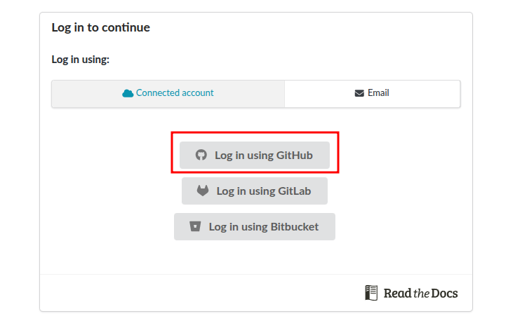

Documentation Demo
===================================

This is a demo page to show how to use ReadtheDocs to automatically generate documentation website based on your **Python** code. Other code such as Arduino, C/C++ should also be supported but needs to be tested.

Readthedocs automatically pulls docstrings from your code file. Some useful tutorials can be found `here <https://docs.readthedocs.com/platform/stable/tutorial/index.html>`_, `here <https://pythonforthelab.com/blog/documenting-with-sphinx-and-readthedocs>`_, and `here <https://amazonwebshark.com/open-source-documentation-with-read-the-docs>`_.

Different from Github, Readthedocs uses reStructuredText (``.rst`` format, instead of ``.md`` format of Markdown) for plain text markup. Here are some cheat sheets of the ``.rst`` format:

- `<https://github.com/ralsina/rst-cheatsheet/blob/master/rst-cheatsheet.rst>`_
- `<https://sphinx-tutorial.readthedocs.io/cheatsheet>`_

This demonstrates the page reference function:
:ref:`modulefactorial` and :ref:`modulepeople`.

.. note::

   This project is under active development.

Setup
---------
1. Register an account on `Read the Docs <https://docs.readthedocs.com/platform/stable/tutorial/index.html>`_. In the page, connect your GitHub account.

2. Fork this repo () and name the new repo based on your project. You will use it as a starting point. 

3. Go back to your ReadtheDocs homepage, click the ``Import a Project`` button on the top of the page, and then select the repository you just created by clicking the + sign next to it.   
   
.. caution:: 
   Please make sure that the repository you created is **public** in order for Readthedocs to access it. 
   
4. Readthedocs will import the selected repository and start bulding the website. Under the ``Builds`` tab, you can see the build progress or errors. Typically the build should finish in about 30 seconds. Once the build passes, press the green ``View Docs`` button on the top right corner. It will open up a webpage which is the same as you are looking at right now.

5. Now your webpage is live online and you could copy the url and share it with others! By default, Readthedocs tracks the repository such that each ``push`` operation will trigger a rebuild (update) of the entire webpage, as you can see in the ``Builds`` tab.

Visual Studio Code Setup (Optional but Highly Recommended)
-------------------------------------------------------

1. As mentioned above, each ``push`` operation to your GitHub repository will automatically trigger a rebuild of the entire webpage. Although this process is relatively fast (<1 min), it is still preferrable if we can see the changes reflected locally and in *real time* before pushing the changes to GitHub. In this case, we can use Visual Studio Code (VSCode) to build the documentation website locally.

2. Clone the GitHub repository you just created to your local PC and open the folder in VSCode through ``File -> Open Folder...`` tab.

3. Open the ``conf.py`` file under the ``docs/source/`` folder. Select the Python interpreter by pressing ``Ctrl+Shift+P`` and type ``Python: Select Interpreter`` in the popup window. Click ``python: Select Interpreter`` and choose the python excutable you want to use. According to `this page <https://docs.readthedocs.com/platform/stable/tutorial/index.html>`_, you can also select a virtual python environment.  

4. Install the following packages.
   xxx

5. Go to the Extensions tab on the left panel of VSCode. Install the ``Python`` extension by Microsoft and any subsequent extensions it prompts you to install. The install ``Live Preview`` extension by Microsoft. Then install ``rstStructuredText`` extension by LeXtudio Inc. Then install ``reStructuredText Syntax`` extension by Trond Snekvik if  VSCode does not automatically prompt you to do so. In the end, VSCode should also prompt you to install ``esbonio`` and ``Preview Engine``, please also install it. 

6. Now you should see a ``esbonio`` label on the bottom status bar of VSCode. If you click it, it will probably says ``esbonio: Sphinx not found``. Don't worry. Open the ``settings.json`` file under ``.vscode`` folder that was just created. Add the following lines and save the file. 

.. code-block:: json

   "esbonio.sphinx.confDir": "${workspaceFolder}/docs/source",
   "esbonio.sphinx.buildDir": "${workspaceFolder}/docs/source/_build",

.. note:: 
   if ``.vscode`` folder is not automatically created, please manually create it under the root folder and create the ``settings.json`` file inside it.

7. Click the ``esbonio`` label on the bottom status bar again to rebuild the webpage. If the build succeeds, you should see something like below:  

8. Now you should see a ``_build`` folder created under the ``docs/source/`` folder. Open the ``index.html`` file under the ``_build/html/`` folder in VSCode, and click the ``Preview`` button on the top right corner.
   
9.  A webpage should automatically pop up in VSCode that looks like the following. Now each time you make some changes to any of the webpages and save, the webpage on the right will automatically refresh to reflect the changes.

10. Now we will move to the next section and show how to modify this demo page based on your own project. 

Modify the Contents
---------------------

1. The main configuration file are ``.readthedocs.yaml`` and ``/docs/cnf.py``. You could infer the meaning of each settings by their names. Please keep most of the settings unchanges unless **you underdstand what you are doing**. However, you should change the ``esbonio``,``esbonio``,``esbonio``, ``esbonio``, and ``esbonio`` information to fit your own identity.

2. The main page is ``/docs/source/index.rst``. Each other page should have their own ``.rst`` file and be added to the main page under  ``..toctree::``. 

.. note:: 
   Sphinx requires that the toctree lists include all pages. If a page is not in any toctree, it is a page with no parent page, or an "orphan page, and the Sphinx build will produce an error. If for some reason a page must be in the documentation not in the left navigation, the ``:orphan:`` directive can be added at the top of that page so that Sphinx will build without errors (as seen on this page!). Please avoid the ``:orphan:`` directive as much as possible.

3.IN the demo, we showed two codes (``factorial.py``and ``python.py``) used as Python modules, i.e., they are saved under ``my_module/`` folder with a ``__init__.py``file. Typically, each ``.py`` file should be accompanied with a corresponding ``.rst`` file under ``docs/source/`` (or subfolder of ``docs/source/``). They don't need to share the same name but it is recommended to do so.

4. In ``my_module/factorial.py``, a function ``factorial()`` is defined. Similarly, in ``my_module/people.py``, two classes ``People`` and ``Teacher`` are defined, where ``Teacher`` subclasses ``People``. All the documentation should be put in the triple quotation marks as shown in the file. Doc test is also supported by using the ``>>>`` symbol.

.. note::
   Check in the documentation of the class ``Teacher`` in ``my_module/people.py`` how we use the internal cross-reference ``:class: `Person` `` to link to the documentation of its parent class ``People``.

Document cpp files
---------------------

- `https://devblogs.microsoft.com/cppblog/clear-functional-c-documentation-with-sphinx-breathe-doxygen-cmake <https://devblogs.microsoft.com/cppblog/clear-functional-c-documentation-with-sphinx-breathe-doxygen-cmake>`_
- `https://medium.com/@aytackahveci93/documenting-c-code-with-sphinx-d6315b338615 <https://medium.com/@aytackahveci93/documenting-c-code-with-sphinx-d6315b338615>`_

.. note:: 
   This project is under active development. 
   

Contents
--------

.. toctree::

   usage
   factorial
   api
